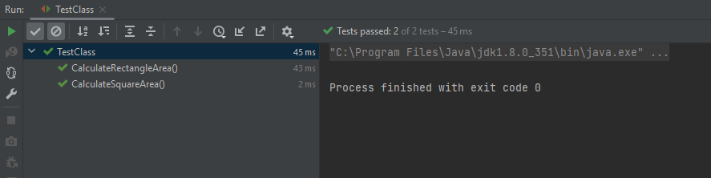

# 
<p dir="rtl">برای توسعه برنامه خواسته شده به روش آزمون محور (TDD) ابتدا کلاس تست مربوط به همراه توابع تست مناسب را ایجاد می کنیم :
</p>


```java
class TestClass {
    @Test
    void CalculateRectangleArea(){
        Rectangle rectangle = new Rectangle();
        rectangle.setHeight(30);
        rectangle.setWidth(20);
        assertEquals(600, rectangle.calculateArea());
    }
    
    @Test
    void CalculateSquareArea(){
        Square square = new Square();
        square.setLength(20);
        assertEquals(400, square.calculateArea());
    }
}
```
<p dir="rtl"> که هرکدام از این توابع عملکرد درست مربوط به یکی از اشیاء مستطیل یا مربع را بررسی می کنند.
</p>
<p dir="rtl">
سپس برای رفع خطا ها اقدام به ایجاد کلاس های Rectangle و Square می کنیم. در اینجا باید توجه داشت که برای رعایت اصل سوم از اصول SOLID یا اصل Liskov substitution باید دو کلاس مجزا برای مستطیل و مربع تشکیل دهیم؛ زیرا در حالی که در ظاهر مربع نوعی مستطیل است و می توان کلاس مربع را فرزند کلاس مربع قرار داد، به دلیل تفاوت های کلاس مربع این کلاس ویژگی تعویض پذیری (substitutability) را نقض می کند و نمی توان آن را فرزند مستطیل قرار داد (برای مثال تابعی که بخواهد مساحت مستطیل را ده درصد افزایش دهد با کلاس مربع به درستی کار نمی کند).
</p>
<p dir="rtl">
کلاس مستطیل:
</p>

```java
public class Rectangle {
    private float height;
    private float width;

    public void setHeight(float height) {
        this.height = height;
    }

    public void setWidth(float width) {
        this.width = width;
    }

    public float calculateArea(){
        return this.width * this.height;
    }
}
```
<p dir="rtl">
کلاس مربع:
</p>

```java
public class Square {
    private float length;

    public void setLength(float length) {
        this.length = length;
    }

    public float calculateArea(){
        return length * length;
    }
}
```
<p dir="rtl">
و در نهایت هر دو تست به درستی طی می شوند:
</p>



<p dir="rtl">
پاسخ سوالات:
سوال اول: پنج اصل SOLID:
</p>

<p dir="rtl">
1- اصل یک مسئولیت: هر ماژول (کلاس) باید تنها به یک نقش پاسخگو باشد، یا به بیان دیگر هر کلاس تنها باید به یک دلیل تغییر کند. این اصل به این دلیل وجود دارد که اگر یک کلاس به دو نقش پاسخگو باشد و سپس به دلیل تغییر نیاز های یک نقش تغییر کند ممکن است در پاسخگویی آن به نقش دیگر مخاطراتی ایجاد شود.
</p>

<p dir="rtl">
2- اصل باز - بسته: ماهیت های نرم افزاری باید برای گسترش پذیر باشند (در مقابل گسترش باز باشند) اما برای این امر نیازی به تغییر نداشته باشند (در برابر تغییر بسته باشند). یکی از دلایل این اصل این است که اگر برای گسترش یک کلاس نیاز به تغییر قسمت های پیشین آن باشد ممکن است عملکرد های قبلی با این تغییر مختل شود.
</p>
<p dir="rtl">
3- اصل جایگزینی لیسکو: کلاس های فرزند بک کلاس پدر باید این قابلیت را داشته باشند که بدون اینکه کلاس های دیگر ماهیت اصلی آن ها را بدانند از آن ها استفاده کنند. اگر این اصل به درستی رعایت نشود ممکن است کلاس های دیگر عملکر هایی داشته باشند که با بعضی کلاس ها به درستی و با بعضی دیگر (بدون خطای زمان کامپایل) به غلط کار کند و باگ های پنهانی ایجاد کنند.
</p>
<p dir="rtl">
4- اصل تفکیک روابط: هیچ کاربری نباید وابسته به توابعی باشد که از آن استفاده نمی کند. برای مثال یک کلاس که از طریق یک رابط از یک کلاس دیگر استفاده می کند نباید نیازی به اطلاع از شرایط و روش عملکر توابع کلاس اصلی داشته باشد.
</p>
<p dir="rtl">
5- اصل وارونگی وابسته: طبق این اصل ماژول های سطح بالا نباید وابسته به ماژول های سطح پایین باشند بلکه ماژول های سطح پایین باید وابسته به ماژول های سطح بالا باشد.
</p>

<p dir="rtl">
سوال دوم: اصول SOLID معمولا در مراحل طراحی استفاده می شوند. پس از تحلیل نیارمندی ها، برای رفع آن ها و بر پایه اصول SOLID طراحی نرم افزار انجام می شود تا سپس بر اساس این طراحی نرم افزار پیاده سازی شود.
</p>


<p dir="rtl">
سوال سوم:
خیر هیج تناقضی ندارد. تست ها در فرایند 
tdd
خود یک حالت تکاملی طی میکنند و با رشد و توسعه نرم افزار آن ها هم رشد میکنند و عملا نمیتوان تست با پیچیدگی بالا را در مراحل اول پیاده سازی به دقت توصیف کرد و یک فرایند دائما رفت و برگشتی لازم است.
با توجه به این نکته میتوان فهمید عملا تفاوت اصلی این دو روش تقدم یا تاخر اجرای تست ها نیست بلکه در 
tdd 
با هدف پاس شدن تست ها کد میزنیم که باعث بهبود دقت کد و اجرای دقیق تر آن میشود به نسبت روشهایی که تست چندان اولویت نیست و در پایان و به احتمال زیاد تعداد کمی از آن ها بررسی میشود.
</p>


